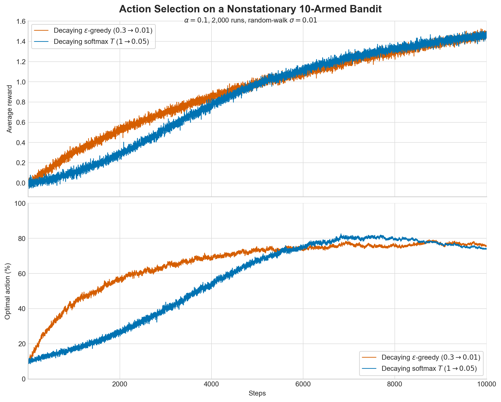
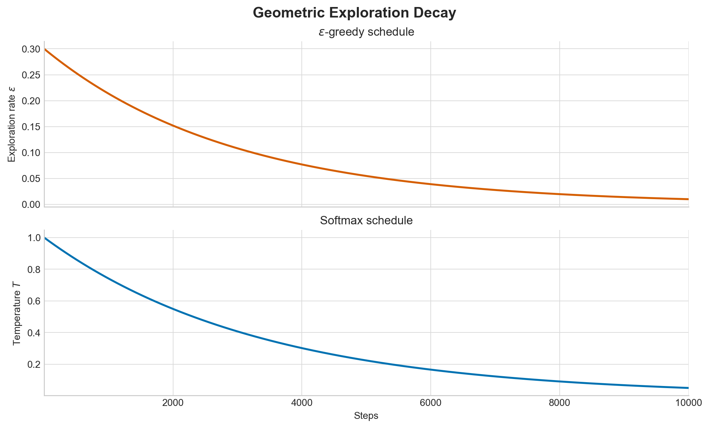

# Decaying Action-Selection Comparison

## Experiment

This experiment compares decaying epsilon-greedy selection with decaying
softmax (Boltzmann) selection on the nonstationary bandit from Part 1. Each of
the 2,000 runs has 10 actions whose true values begin at
zero and take independent Gaussian random-walk steps with standard deviation
0.01. Rewards have standard deviation
1. Both agents use the constant action-value step size
alpha = 0.1; therefore, action selection is the main experimental
difference.

Epsilon decays geometrically from 0.3 to
0.01. Softmax temperature decays geometrically from
1 to 0.05. Nonzero final
values preserve some adaptation in the nonstationary environment.

## Results

Over the final 1,000 steps, epsilon-greedy obtains average reward
1.4272 and selects the optimal action
76.74% of the time. Softmax obtains
average reward 1.4305 and selects the optimal
action 75.49% of the time. Thus, the
late-run softmax-minus-epsilon-greedy differences are
+0.0033 reward and
-1.25 percentage points.
During the first 1,000 steps, the corresponding differences are
-0.1079 reward and
-15.50 percentage points.

## Discussion and hypotheses

1. Epsilon-greedy is substantially better early in this run. Its initial
   epsilon of 0.3 still chooses a greedy action on most
   steps, whereas the initial softmax temperature of
   1 is large compared with the small early
   action-value differences. Softmax is therefore close to uniform for longer,
   which explains its lower early reward and optimal-action rate.

2. The gap closes as temperature falls and the true action values spread out.
   Both effects make the softmax probabilities more concentrated. Softmax then
   uses its graded preference among actions: unlike epsilon-greedy exploration,
   it gives plausible actions more probability than actions currently believed
   to be poor.

3. Late reward is nearly tied even though epsilon-greedy selects the exact
   optimum somewhat more often. A likely explanation is that softmax sometimes
   chooses the second- or third-best action when its value is very close to the
   maximum. This hurts the binary optimal-action metric but may cost almost no
   reward. The late reward difference is small enough that it should not be
   treated as strong evidence of a softmax advantage without additional seeds
   or confidence intervals.

4. Decay creates a stability-adaptation tradeoff. Smaller epsilon and
   temperature improve exploitation, but this problem never becomes
   stationary. If either schedule approached zero too quickly, an agent could
   stop revisiting actions whose true values later random-walk upward. The
   nonzero endpoints used here reduce, but do not eliminate, that risk.

5. Softmax is sensitive to the numerical scale of the value estimates. A
   temperature schedule that works for reward standard deviation
   1 and random-walk standard deviation
   0.01 may perform differently after either scale is
   changed. Epsilon has a more direct interpretation, so schedule sweeps would
   be needed before making a general claim that one selector is superior.

The first plotted point is 100% optimal for both methods because, as in Part 1,
all true values are tied at zero before the first random-walk transition. This
single point does not affect the long-run comparison.
