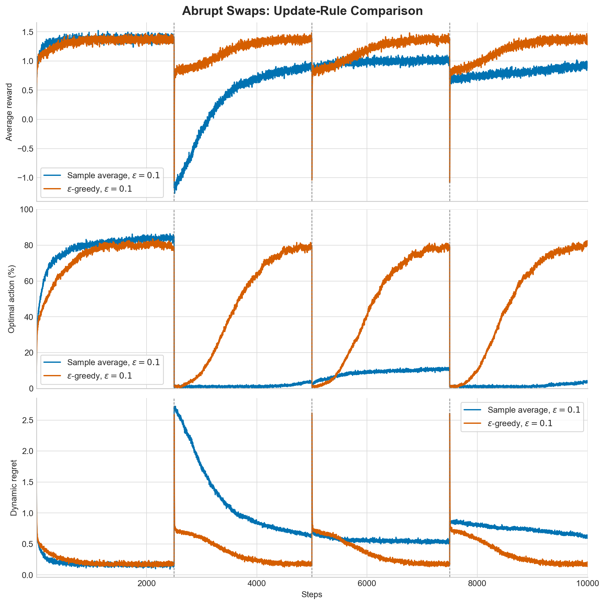
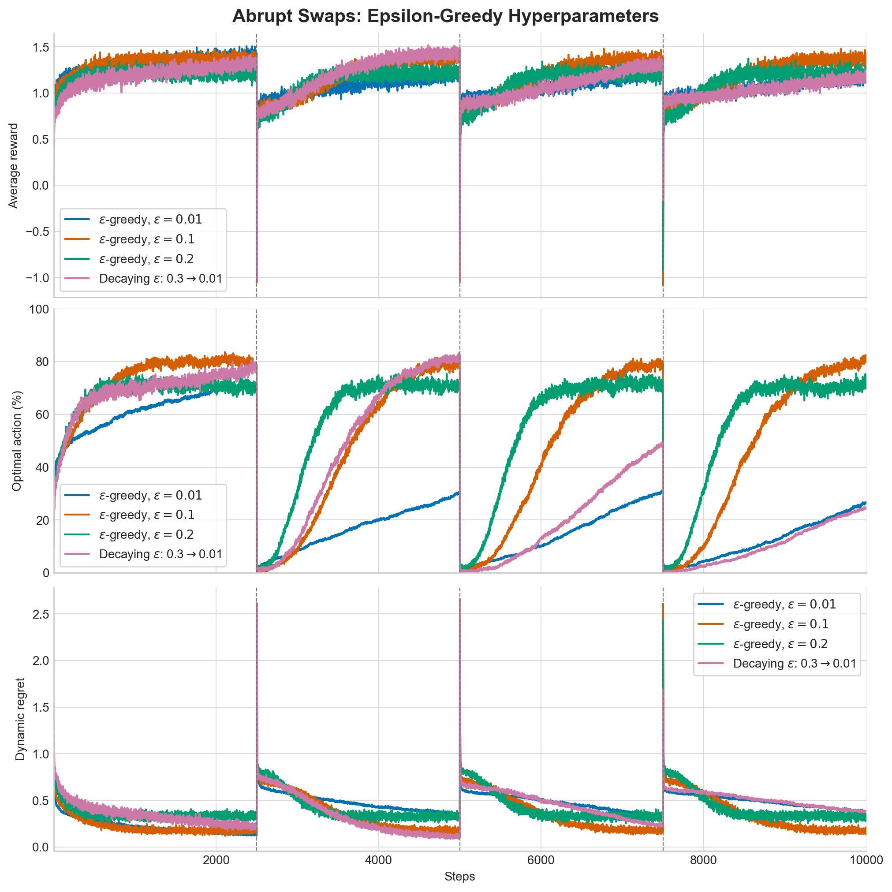
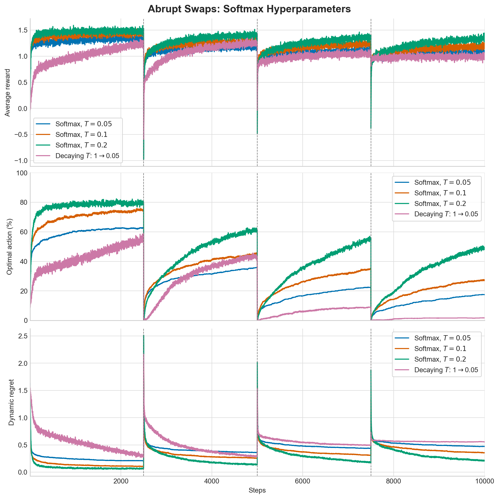

# Abrupt Regime-Switching Bandit

The expected rewards are stationary between change points. At steps
2500, 5000, 7500, the current best
and worst arms exchange payouts independently in every run. Dashed vertical
lines in the plots mark these shocks.

The experiment averages 1,000 runs of 10,000 steps. It
compares sample-average and constant-step updates, three fixed epsilon values,
three fixed temperatures, and decaying epsilon and temperature schedules.

## Plots

## Results

The lowest average dynamic regret during the first 250
steps after each shock belongs to **Softmax, $T=0.1$**
(0.5434). The lowest regret over the
final 1,000 steps belongs to **$\epsilon$-greedy, $\epsilon=0.1$**
(0.1877).

Abrupt swaps punish methods that give too much weight to old observations.
Sample averages retain the complete pre-change history and therefore usually
reverse their rankings slowly. Constant step sizes forget old evidence
geometrically and should recover faster. Exploration floors matter because the
new best arm was the old worst arm; a nearly greedy agent may rarely revisit
it. Larger epsilon or temperature should improve recovery immediately after a
shock but sacrifice reward during stable intervals. The best setting therefore
depends on both shock frequency and the desired recovery speed.
