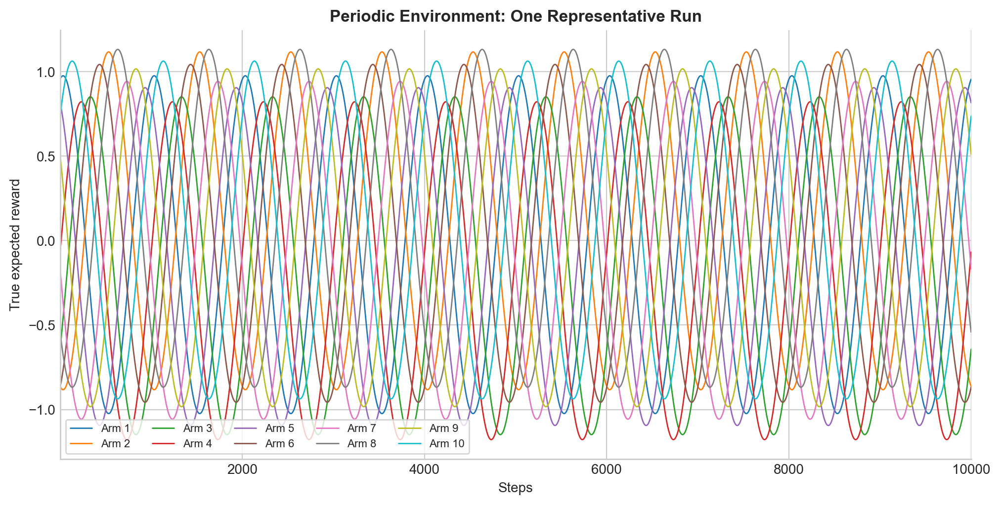
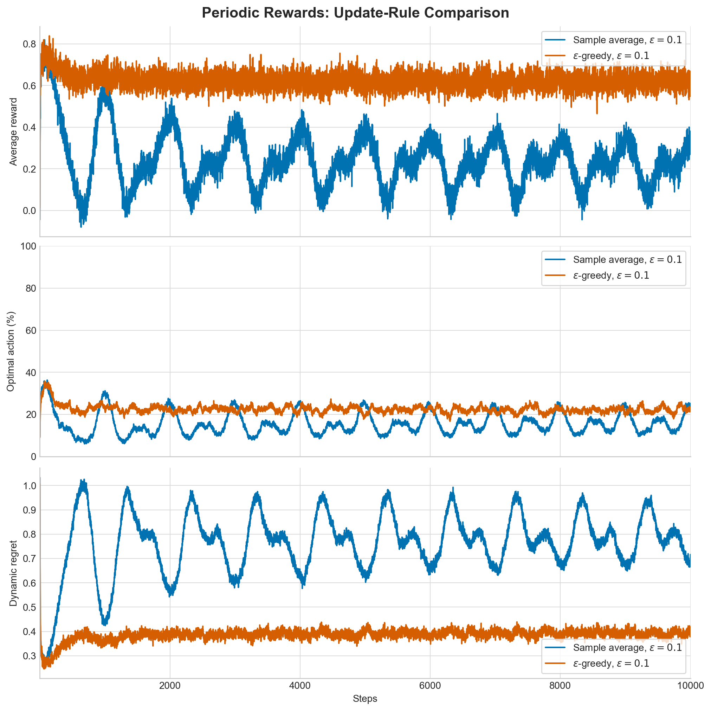
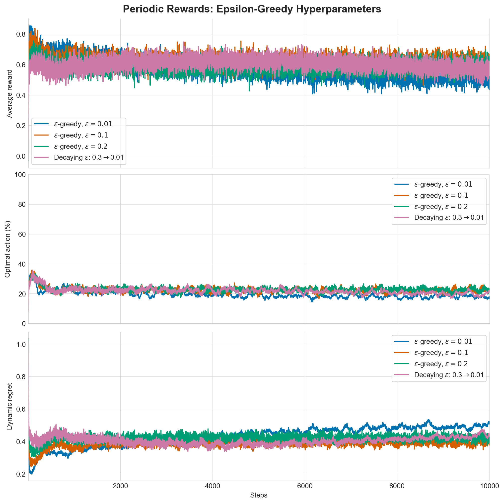
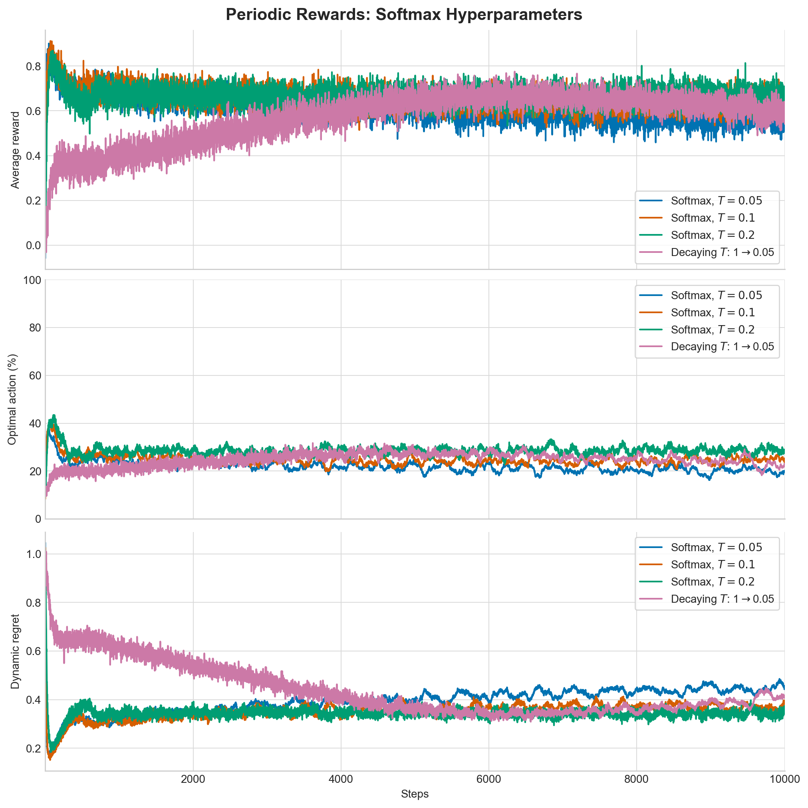

# Periodic Nonstationary Bandit

Each arm follows a sinusoidal expected reward with amplitude
1 and period 1,000. Arm phases are evenly spaced,
then randomly permuted in each run; every run also receives a random global
phase and small arm-specific baselines. The identity of the best arm changes
throughout all 10,000 steps.

The experiment averages 1,000 runs and compares sample-average and
constant-step updates, three fixed epsilon values, three fixed temperatures,
and decaying epsilon and temperature schedules.

## Plots

## Results

The lowest overall dynamic regret belongs to **Softmax, $T=0.2$**
(0.3424). Over the final complete
cycle, the lowest regret belongs to **Softmax, $T=0.2$**
(0.3427).

Periodic rewards create a tracking problem. Sample averages combine evidence
from many incompatible phases and should lag badly. A constant step size
forgets older observations and can follow the cycle, although a larger alpha
would trade less lag for more reward-noise sensitivity. Very small epsilon or
temperature can lock an agent onto an arm after its peak has passed. Larger
exploration improves discovery of the next rising arm but sacrifices reward at
each moment. Decaying exploration is especially questionable here because the
environment keeps changing forever; a nonzero floor is needed for continued
tracking. Softmax can benefit near arm crossings by shifting probability
gradually among several nearly optimal arms, but its best temperature depends
on the reward scale.
